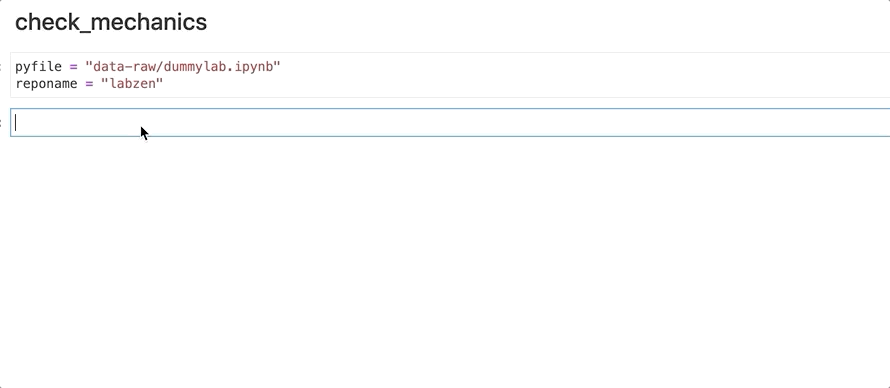

# labzen 

 
[](https://codecov.io/gh/UBC-MDS/labzen) 
[](https://github.com/UBC-MDS/labzen/actions/workflows/deploy.yml) 
[](https://labzen.readthedocs.io/en/latest/?badge=latest)
[](https://www.repostatus.org/#concept)


`labzen` is a Python package that adds more [zen](https://en.wikipedia.org/wiki/Zen) to your student experience of working on [MDS](https://masterdatascience.ubc.ca/) labs. It lets you manage common tasks such as counting total marks in an assigment, and performs common checks for mechanics in your iPython notebooks and R markdown assignments.

## Installation

```bash
$ pip install --index-url https://test.pypi.org/simple/ --extra-index-url https://pypi.org/simple labzen
```

## Features

**labzen** helps members of the [UBC Master of Data Science (MDS)](https://masterdatascience.ubc.ca/) manage lab assignments written in iPython notebooks and R markdown. The package saves precious student time by automating common tasks such as counting up total marks in a lab assignment, and performing common mechanical checks that can-- if overlooked-- lose a student easy marks.

The package is currently under development, but will include the following functions:

- **Function 1**: The internal `parse_lab()` function will take an MDS .ipynb or .Rmd lab and return its markdown contents as a list/vector of strings. The function will scrub out yaml, code blocks, and all other metadata.

- **Function 2**: `count_points()` will build upon the first function and further parse labs into sections using regex. Further string manipulation will determine how many optional and required points there are per section based on the rubric tags. The function will return a table of totals so that students can plan how many optionals they wish to complete.

- **Function 3**: `check_mechanics()` conduct and print a series of mechanics checks to screen. For example, the function will
    - Check that you have included a Github repo link;
	- Check that you have pushed the latest version; and
	- Check that you have at least three commits.

The package data will include a directory of public and/or dummy lab files (.ipynb and .Rmd). Private or unpublished lab files will not be committed to the repository.

To the authors' knowledge, no package yet exists in the Python ecosystem that serves this specific purpose. However, several existing packages will be used to power the functionality of `labzen`, including `GitPython`, `pandas`, and `nbformat`. Some other python repos and past assignments may be used as inspiration, such as the parsing work done in the _throughput database_ in DSCI 513.

A parallel implementation for R exists [here](https://github.com/UBC-MDS/labzenr).

## Dependencies
```
python = "^3.8"
pandas = "^1.2.3"
nbformat = "^5.1.2"
PyGithub = "^1.54.1"
GitPython = "^3.1.14"
glob2 = "^0.7"
mock = "^4.0.3"
```
Visit [pyproject.toml file](pyproject.toml) file for complete list of `labzen` dependencies.
## Usage

In order to show the usage of our package, we provided two dummy labs, one [Rmarkdown lab](https://github.com/UBC-MDS/labzen/blob/main/data-raw/dummylab.Rmd) and one [Jupyter notebook](https://github.com/UBC-MDS/labzen/blob/main/data-raw/dummylab.ipynb).

Clone labzen repository using the following command:
```
https://github.com/UBC-MDS/labzen.git
```
Navigate to the root of labzen repo. From the root of repository run the following python commands:

```
>>> from labzen import labzen as lz
# for jupyter notebook:
>>> df, tab = lz.count_points("data-raw/dummylab.ipynb")
>>> print(df)
>>> print(tab)

# for Rmarkdown:
>>> df, tab = count_points("data-raw/dummylab.Rmd")
>>> print(df)
>>> print(tab)
```
 This will return a tuple of DataFrames. The first Dataframe is a section-by-section overview of points available. The second Dataframe is a cross table summarizing the number of optional, required, and total points per lab.

 To check the lab mechanics run the following python commands: 

```
lz.check_mechanics(<repo_name>, <filename>)
```

`check_mechanics()` checks that you have provided a Github repo link, that you have pushed your latest commit, and that you have at least three commit messages authored by you in your history.

The below git shows how to run `check_mechanics()`



The repo name should be present under https://github.ubc.ca. After running the code, it would ask first for a github token, and then  ask for a local git path. 

For macOS provide the following path format:
```
/Users/jene/MDS/Block5/lab/DSCI_599_lab1_jene3456
```
and for windows provide the following path format:
```
 C:\\Users\\jene\\MDS\\Block5\\lab\\DSCI_599_lab1_jene3456
```


## Documentation

The official documentation is hosted on Read the Docs: https://labzen.readthedocs.io/en/latest/

## Contributors

This package is authored by Sukhdeep Kaur, Kamal Moravej Jahromi, and Rafael Pilliard-Hellwig as part of an academic assignment in the UBC MDS program. For a full list of contributors, please see the [contributors tab](https://github.com/UBC-MDS/labzen/graphs/contributors). 

We warmly welcome and recognize contributions from the community at large. If you wish to participate, please review our [contributing guidelines](CONTRIBUTING.rst) and familiarize yourself with [Github Flow](https://blog.programster.org/git-workflows).
### Credits

This package was created with Cookiecutter and the UBC-MDS/cookiecutter-ubc-mds project template, modified from the [pyOpenSci/cookiecutter-pyopensci](https://github.com/pyOpenSci/cookiecutter-pyopensci) project template and the [audreyr/cookiecutter-pypackage](https://github.com/audreyr/cookiecutter-pypackage).
