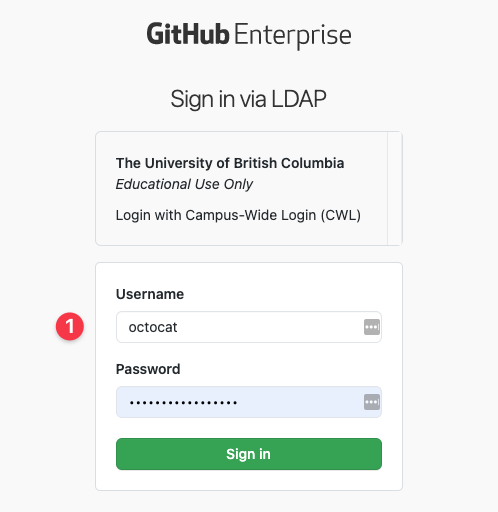
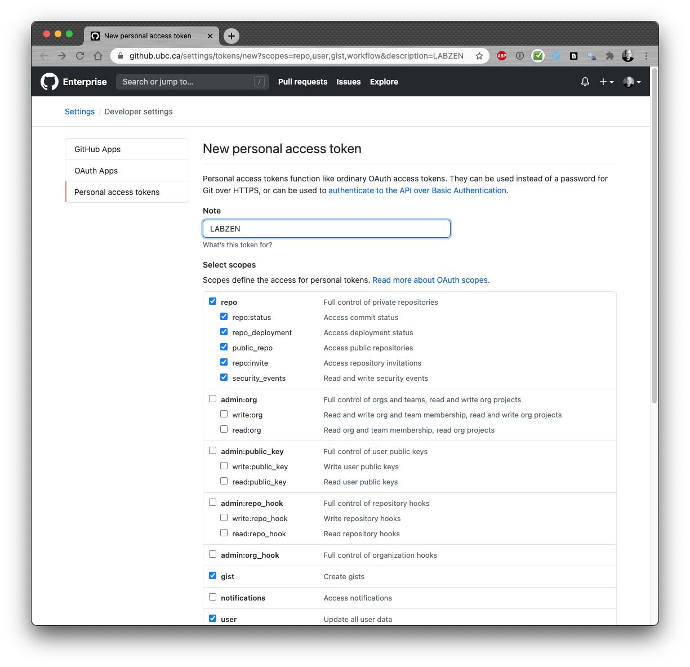
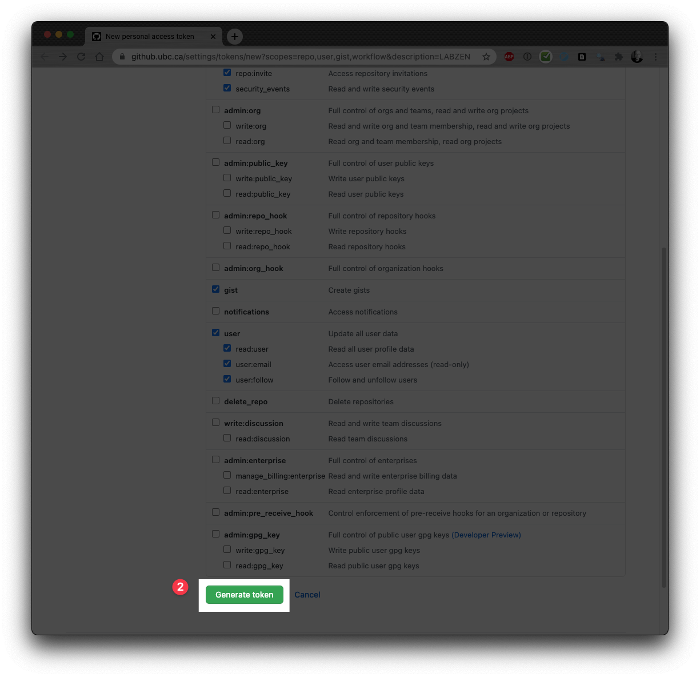
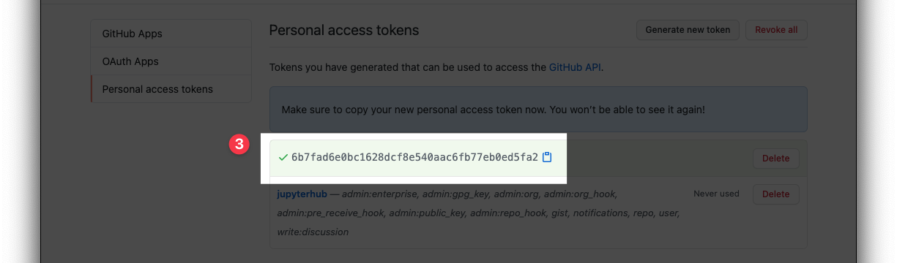

.. highlight:: python

============
Generating a Github Token
============

A Github token will be needed to successfully run several ``labzen`` functions.
This token must be from UBC's Github Enterprise (GHE) site, not from Github.com.

If you have ``labzen`` installed, you can generate a token by following the following 
steps in Python:

.. code-block:: python

    from labzen import labzen as lz
    lz.create_github_token()

This will open up a browser to Github Enterprise.

After entering your username and password, you should see a page like this:

Scroll all the way down to the page and generate the token.

Next, copy the token and save it in safe place. 
After you close the browser window, you will not be able to copy this token again 
(you can, however, re-generate a new token if you misplace this one).

``labzen`` does not yet use a credentials management system, 
so you you will need this token anytime you run a ``labzen`` checking function.
